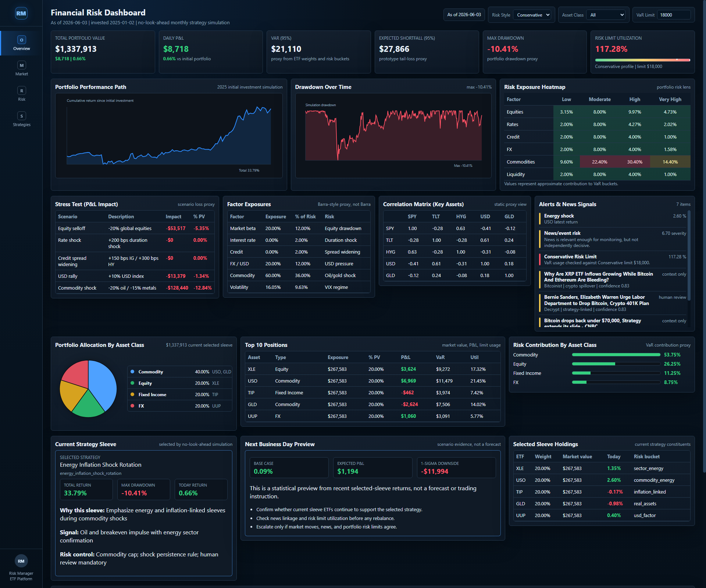
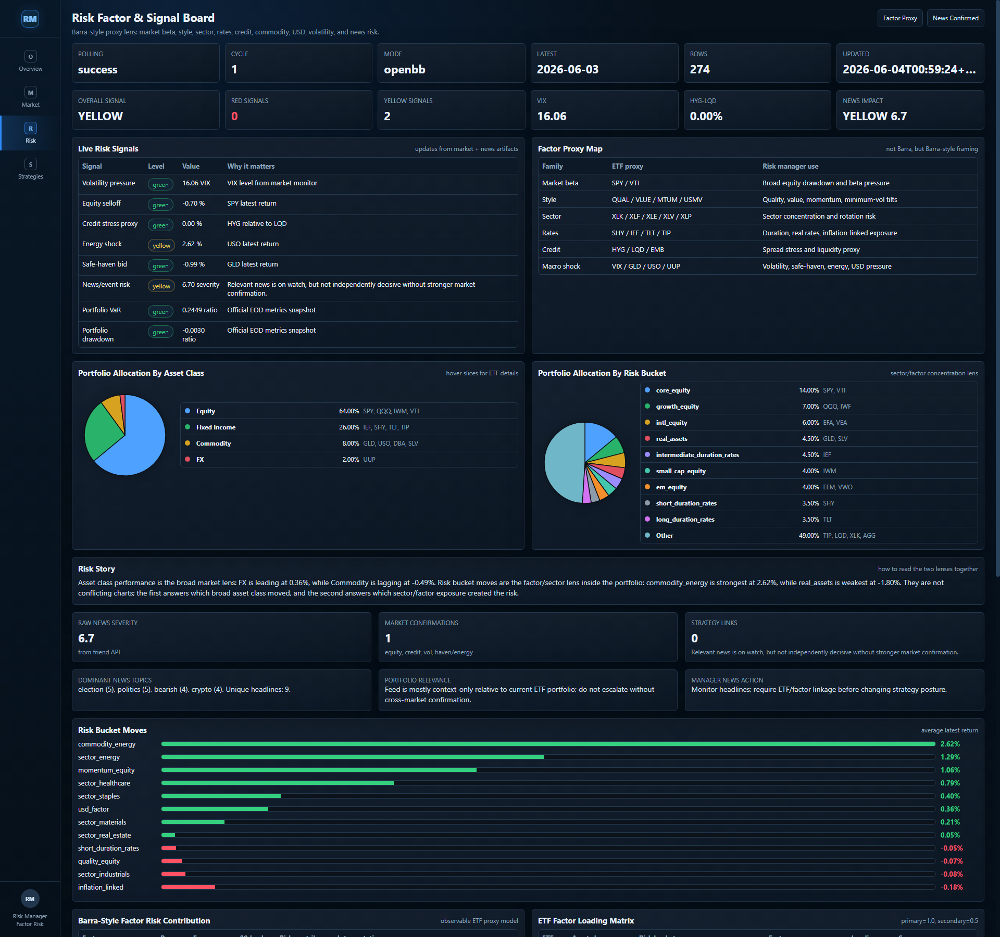
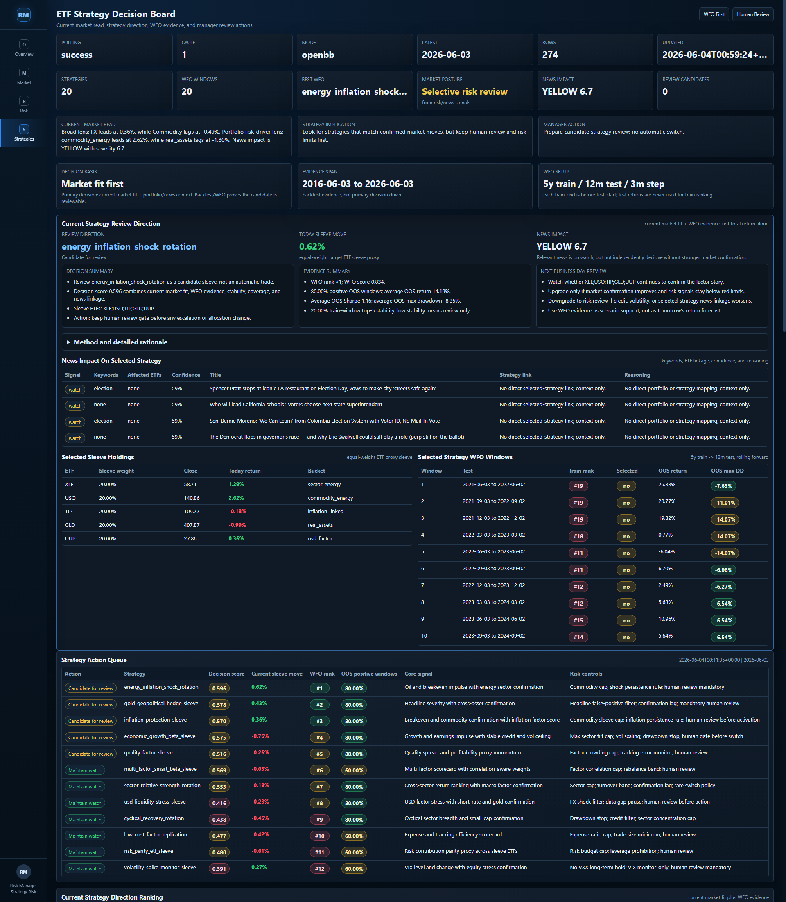
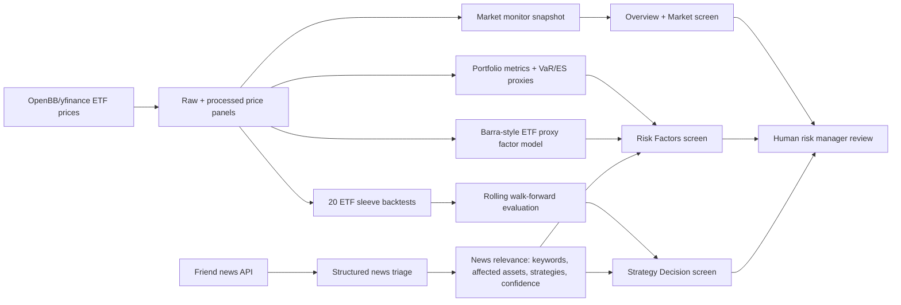

# Live Strategy Risk Workstation (Prototype)



## Executive Summary

This repository is a **shareable ETF risk and strategy dashboard prototype** for a Bloomberg-style, live-style quantitative risk manager workflow. It combines portfolio monitoring, factor risk, structured news triage, and walk-forward strategy evidence into a three-screen web workstation.

The current demo simulates a USD 1,000,000 strategy-guided ETF portfolio from **2025-01-02** to **2026-06-03**, evaluates **20 ETF strategy sleeves**, and presents a current manager-review candidate: **Energy Inflation Shock Rotation** (`XLE`, `USO`, `TIP`, `GLD`, `UUP`).

The project supports internship and portfolio research on **after-market risk explanation**, macro regime awareness, factor and portfolio risk, and strategy governance. It is **not** a production trading system and does not execute trades.

## Live Website / Deployment

The dashboard is designed to be deployed as a normal website, so the reviewer can open it without your laptop running.

- Local preview requires a local server, for example `python -m http.server 8630`.
- Public always-open access requires deployment on Render, Railway, Fly, VPS, GitHub Pages, or Cloudflare Pages.
- For Render deployment instructions, see [DEPLOY_NOW.md](DEPLOY_NOW.md).
- For a boss-ready walkthrough, see [BOSS_DEMO_RUNBOOK.md](BOSS_DEMO_RUNBOOK.md).

Recommended first hosted deployment mode:

```text
MARKET_DATA_MODE=none
ENABLE_POLLING=true
POLLING_INTERVAL_SECONDS=60
NEWS_API_URL=https://news.tcx086.com/analysis/patterns
```

This serves stable committed market/risk/strategy snapshots and polls the friend news feed. OpenBB/yfinance cloud polling can be tested after the public URL works.

## Dashboard Screens

| Screen | Purpose | Link |
|--------|---------|------|
| Overview | Portfolio value, P&L, VaR/ES proxy, drawdown, risk limit usage, strategy decision map, selected sleeve preview | `web_dashboard/index.html` |
| Market Monitor | Bloomberg-style ETF tape, top/worst movers, monitor-only assets, live polling status | `web_dashboard/market.html` |
| Risk Factors | Barra-style ETF proxy factor risk, risk signals, allocation, factor matrix, news/event risk triage | `web_dashboard/risk.html` |
| Strategies | Current strategy candidate, WFO evidence, selected sleeve holdings, backtest/WFO details, strategy playbook | `web_dashboard/strategies.html` |

### Risk Factors



### Strategy Decision Board



## Operating Workflow



## Strategy Selection Logic

The dashboard does **not** select a strategy from total return alone.

Current decision hierarchy:

1. **Current market fit:** Which ETF sleeves are consistent with today's market and factor moves?
2. **Walk-forward evidence:** 5-year training window, 12-month out-of-sample test window, 3-month rolling step, 20 rolling windows.
3. **Risk behavior:** drawdown, VaR proxy, factor concentration, risk limit usage.
4. **News linkage:** headline relevance, affected tickers, affected strategies, confidence, and market confirmation.
5. **Human review gate:** no automatic strategy switch or trade execution.

Current selected sleeve:

| Field | Value |
|-------|-------|
| Strategy | Energy Inflation Shock Rotation |
| ETF sleeve | XLE, USO, TIP, GLD, UUP |
| Thesis | Emphasize energy and inflation-linked exposures during commodity/inflation shocks |
| Evidence | Rolling WFO support plus current commodity/energy market fit |
| Governance | Manager review only; not an automatic trade |

## What To Say In A Demo

Short version:

> This is a prototype ETF risk and strategy workstation. It separates market monitoring, factor risk, and strategy decision support into three screens. The strategy page does not rank by return alone; it combines current market fit, rolling walk-forward evidence, news relevance, drawdown behavior, and a human review gate.

Important limitation:

> This is OpenBB/yfinance prototype data and an observable ETF proxy factor model. It is not Bloomberg tick data, not commercial Barra, not investment advice, and not automated execution.

## What This System Is

- A structured **policy and configuration layer** for a multi-asset ETF monitoring universe
- A **strategy library** with explicit regime fit, failure modes, and human-review requirements
- **Rule-based regime and risk triggers** with numeric prototype thresholds
- A **config validation layer** (pandas) that fails loudly on bad CSV policy files
- A **prototype rule engine** that evaluates sample daily metrics against thresholds and aggregates rule-level alerts

## What This System Is Not

- **Not** automated trading or order execution
- **Not** investment advice or a live managed portfolio
- **Not** a completed alpha validation or walk-forward engine (baseline ETF sleeve backtests are prototype comparisons only)
- **Not** a Bloomberg-quality live institutional feed (OpenBB/yfinance prototype adapter only)
- **Not** a production dashboard; the current web dashboard is a non-Streamlit HTML/CSS/JS prototype reading generated JSON artifacts

## Current Implemented Status

| Area | Status |
|------|--------|
| Config layer (`holdings`, `strategy_library`, `regime_rules`, `regime_thresholds`) | Implemented |
| Config validation (`src/data/config_loader.py`) | Implemented |
| Prototype rule engine dry-run (`src/regime/rule_engine.py`) | Implemented |
| Sample metrics (`data/samples/mock_daily_metrics.json`) | Implemented |
| Synthetic price history metrics builder (`src/portfolio/metrics_builder.py`) | Implemented (Phase 3 prototype; not live API data) |
| OpenBB market data adapter (`src/external/openbb_client.py`) | Prototype (yfinance provider) |
| Live market/news API (Friend feed) | Not implemented |
| Web dashboard (HTML/CSS/JS) | Implemented (prototype; reads JSON artifacts) |
| Baseline ETF sleeve backtest | Implemented (prototype; not signal-conditioned alpha validation) |
| Walk-forward strategy evaluation | Implemented (prototype rolling OOS; not signal-conditioned alpha validation) |
| Production backtest / live strategy execution | Not implemented |

## Core Workflow (Target Operating Model)

```
Market monitor -> Portfolio risk -> Regime signals -> Strategy library
    -> News/event risk -> Proposed action -> Human review -> After-market report
```

The prototype rule engine currently implements the middle segment: **metrics -> threshold hits -> rule alerts -> proposed action labels**, with mandatory human review flags for higher-priority outcomes.

## Repository Structure

```
live_strategy/
|-- data/
|   |-- config/          # Committed policy CSVs
|   |-- samples/         # Small committed prototype inputs
|   |-- raw/             # Future raw external feeds (gitignored)
|   `-- processed/       # Future cleaned features (gitignored)
|-- src/
|   |-- data/            # config_loader.py
|   |-- regime/          # rule_engine.py
|   |-- portfolio/       # planned
|   |-- risk/            # planned
|   |-- factors/         # factor_model.py (observable ETF proxy prototype)
|   |-- strategy/        # planned
|   |-- news/            # planned
|   `-- reporting/       # planned
|-- tests/
|-- scripts/
|-- dashboard/
|-- notebooks/
|-- reports/
|-- output/              # Generated artifacts (gitignored)
|-- requirements.txt
`-- PROJECT_ROADMAP.md
```

Context documents (`00_internship_context.md`, `01_project_blueprint.md`, etc.) describe internship scope and design intent.

## Portfolio Universe Summary

The prototype benchmark holdings now include **38 ETFs** across broad equity beta, GICS sector sleeves, smart beta/style factors, rates, credit, real assets/commodities, international equity, and USD liquidity exposure. Weights are defined in `data/config/holdings.csv` as a **multi-sector strategic benchmark** (sum = 1.00). VIX and VXX remain monitor/prototype instruments in `etf_universe.csv`; they are **not** benchmark holdings.

Current sample/OpenBB metric snapshots may still have narrower price coverage than the full 38-ETF benchmark. Portfolio metrics are therefore prototype outputs over the available price overlap until the full ETF universe is fetched, aligned, and validated.

## Multi-Sector ETF Universe and Strategy Library

- **ETF universe:** `data/config/etf_universe.csv` (40+ ETFs across equity sectors, smart beta, rates, credit, commodities, FX, international, and vol monitors)
- **Strategy library:** `data/config/strategy_library.csv` (20 ETF sleeves: macro factor, sector rotation, smart beta, stress overlays, portfolio completion)
- **Scoring policy:** `data/config/strategy_scoring_policy.csv` (prototype weights for ranking)
- **Ranking prototype:** `python scripts/rank_strategies_demo.py` writes `output/strategy_ranking_snapshot.json` for the Strategy Dashboard tab
- **Baseline sleeve backtest:** `python scripts/backtest_strategies_demo.py` writes `output/strategy_backtest_snapshot.json` with return, win rate, Sharpe proxy, drawdown, benchmark-relative return, and price coverage for all 20 strategies
- **Walk-forward evaluation:** `python scripts/walk_forward_strategies_demo.py` writes `output/strategy_walk_forward_snapshot.json` using rolling train/test windows. Fetch 10-20 years first for meaningful output. The WFO score blends out-of-sample return, out-of-sample Sharpe, out-of-sample drawdown, positive test-window rate, and train-window top-5 stability.
- **Methodology notes:** `reports/blackrock_factor_to_assets_notes.md` (factor-to-assets framing inspired by BlackRock / Andrew Ang style research)
- **Boss summary:** `reports/boss_update_summary.md`

All strategies require **human review** before activation or switch. The baseline sleeve backtest is an equal-weight ETF basket comparison. The WFO layer ranks fixed ETF sleeves using past training windows, evaluates the next out-of-sample window, and penalizes unstable train-window selection through the top-5 stability term. These are **not** signal-conditioned alpha validation, not production trading research, and not trade recommendations.

## Rule Engine Dry-Run Summary

`src/regime/rule_engine.py`:

1. Loads validated configs via `load_all_configs()`
2. Loads `data/samples/mock_daily_metrics.json` by default
3. Compares metrics to `regime_thresholds.csv`
4. Aggregates hits by `rule_id` and joins `regime_rules.csv`
5. Returns sorted alerts (priority descending) and `missing_metrics` warnings

Run the demo:

```bash
python scripts/run_rule_engine_demo.py
```

This prints threshold hit count, rule alert count, and top proposed actions. **No trade instructions are emitted.**

Phase 3 adds a synthetic sample price history (`data/samples/sample_price_history.csv`) and
`src/portfolio/metrics_builder.py`, which computes `data/samples/computed_metrics_snapshot.json`
via `python scripts/build_sample_metrics.py`. This is **sample_synthetic** data only, not live
market feeds or OpenBB/Bloomberg integration.

## Observable ETF Proxy Factor Model (prototype)

`data/config/factor_mapping.csv` and `src/factors/factor_model.py` implement an **observable ETF proxy factor model** for dashboard factor exposure and return contribution views. This is **not** a Barra or commercial multi-factor risk model. Factor exposure equals benchmark `target_weight` when the proxy ETF is held; non-held proxies (e.g. VIX) have zero exposure but still show factor returns. Factor returns use simple percent returns over a short lookback from `sample_price_history.csv`.

## ERM Escalation Framework

Each rule alert includes an `escalation_level` calibrated in `src/regime/rule_engine.py` from **threshold severity**, **rule-specific confirmation policy**, and **hard-breach thresholds** - not from rule `priority` alone. `map_escalation_level(priority)` remains a fallback helper only.

| escalation_level | Meaning |
|------------------|---------|
| green | Normal monitoring / informational |
| yellow | Heightened attention, watchlist, defensive review candidate |
| red | Immediate human review after hard breach or confirmed multi-signal stress |

Examples (prototype policy in code):

- `risk_off` requires elevated VIX **and** equity weakness or SPY drawdown confirmation; VIX alone does not fire. Red `risk_off` upgrades only via linked `spy_drawdown_60d` (not portfolio VaR/drawdown limits; those fire `var_breach` / `drawdown_breach`).
- `high_volatility`: VIX >= 30 alone -> yellow (`confirmed_regime_red` needs VIX >= 30 plus equity/vol confirmation); VIX >= 20 or large 1d spike -> yellow.
- Red taxonomy (`hard_limit_red`, `confirmed_regime_red`, `yellow_watch`): see [reports/trigger_logic_user_guide.md](reports/trigger_logic_user_guide.md) section 4.
- **Alert hierarchy (presentation only):** `primary_alerts` drive escalation and human-review counts; full evidence remains in `alerts` and `all_alerts`. **Static runtime hierarchy:** `liquidity_stress` subsumes `credit_stress` via `ALERT_SUBSUME_BY` in `rule_engine.py`. **Regime-aware config:** `data/config/alert_hierarchy.csv` is validated in `config_loader` but **not yet runtime-wired**.
- `var_breach`: `portfolio_var_ratio` -> red; `portfolio_var_ratio_watch` -> yellow only.
- `drawdown_breach`: portfolio drawdown limit -> red; warning band -> yellow only.
- `credit_stress` / `liquidity_stress` / `geopolitical_shock`: multi-threshold confirmation required before firing.

Yellow and red alerts require human review. Green rule outputs (`risk_on`, `low_volatility`, `credit_calm`, and similar) are **informational context only**: they are split into `informational_alerts` in `run_rule_engine` and are not included in main `alerts`. Dashboard and after-market report escalation, human review, and ERM summary counts use **actionable alerts** (yellow/red) only. Informational context explains supportive or benign conditions but does not trigger action.

Thresholds and policies are **prototype** values and must be validated historically (walk-forward / stress windows) before any operational use.

**Metric-level status** (`data/config/metric_status_policy.csv`, `src/regime/metric_status.py`) is separate from rule-level escalation: dashboard metric colors show individual pressure points; **missing** metrics are data-quality warnings and are not counted as green; **final escalation** follows confirmed actionable rule alerts only and must not be read as all-clear when inputs are missing.

This framework supports **monitoring and proposed actions only**. It is **not** automated trading and does not emit execution commands.

## Trigger Logic User Guide

See [reports/trigger_logic_user_guide.md](reports/trigger_logic_user_guide.md) for a boss-friendly explanation of the three layers (metric status, rule alert, final escalation), confirmation matrices, and how to use the dashboard and after-market report. Thresholds are prototype values and require historical calibration.

## Environment-Aware Trigger Framework

Design guidance for how triggers should adapt across regimes, including **escalation**, **de-escalation**, and **re-risk review** (persistence-based, human-approved only). This is **not fully implemented** in the rule engine yet.

- Framework memo: [reports/environment_aware_trigger_framework.md](reports/environment_aware_trigger_framework.md)
- Environment state skeleton: `data/config/environment_states.csv` (documentation/config only; not wired to `rule_engine`)

Current production behavior remains absolute thresholds plus confirmation policy in `src/regime/rule_engine.py`. Environment classification and N-day persistence are planned next steps.

## After-Market Risk Report Generator

`src/reporting/after_market_report.py` builds a risk-manager-style daily memo from computed metrics, rule-engine alerts, holdings, strategy library, and observable ETF proxy factor attribution.

```bash
python scripts/generate_after_market_report.py
```

**Output:** `reports/generated/after_market_risk_report_<as_of_date>.md` (gitignored).

**Scope:** Sample replay / prototype only. **No** live API, **no** trade execution, and **not** investment advice. **No-look-ahead:** metrics, rule engine, and factor snapshot use data available on or before `as_of_date` only.

## Dashboard Prototype

Non-Streamlit HTML/CSS/JS three-screen workstation under `web_dashboard/`:

For a boss-ready walkthrough, use `BOSS_DEMO_RUNBOOK.md`. For deployment steps,
use `DEPLOY_NOW.md`. For a pre-deploy artifact check, run
`python scripts/check_deployment_readiness.py`.

| Tab | Purpose |
|-----|---------|
| Bloomberg-Style Market Monitor | OpenBB monitor snapshot, overnight watchlist, and official EOD/prototype risk metrics |
| Portfolio Risk & Factor Dashboard | Drawdown, VaR ratio, risk-bucket exposure, credit stress proxy, observable ETF proxy factor exposure and contribution (prototype; not Barra) |
| ETF Strategy Decision Board | Current market fit, selected sleeve review direction, WFO evidence, baseline backtest evidence, next-business-day review context, and strategy playbook |

**How to run:**

```powershell
.\scripts\run_web_workstation.ps1 -StartPolling -PollingIntervalSeconds 15 -MarketDataMode openbb -NewsApiUrl "https://news.tcx086.com/analysis/patterns"
```

Direct local screens:

- `http://localhost:8600/web_dashboard/market.html`
- `http://localhost:8600/web_dashboard/risk.html`
- `http://localhost:8600/web_dashboard/strategies.html`

This opens three simultaneous browser windows when `-NoOpen` is not used:

- `market.html` - Bloomberg-style market monitor
- `risk.html` - portfolio risk and factor dashboard
- `strategies.html` - ETF strategy decision board

The pages update visible data by fetching the latest generated JSON artifacts. They do not require Streamlit and do not reload the full page on every polling cycle. This creates a live-style display, but it is not Bloomberg tick data and not exchange-grade streaming. During market hours, refreshed numbers require updated OpenBB/yfinance artifacts or another market/news API feed.

Background live polling can also be started separately:

```powershell
.\scripts\run_live_polling.ps1 -IntervalSeconds 30
```

For a 1-second news/friend-API demo without hammering OpenBB/yfinance:

```powershell
.\scripts\run_live_polling.ps1 -IntervalSeconds 1 -MarketDataMode none -NewsApiUrl "https://your-friend-api/news"
```

For 1-second full market polling, use a lightweight quote API from the friend feed or another provider designed for frequent polling. OpenBB/yfinance is a prototype fallback and may be rate-limited when polled too aggressively.

The polling loop updates:

- `data/raw/openbb_live_price_history.csv`
- `output/openbb_market_monitor_snapshot.json`
- `output/openbb_overnight_watchlist.json`
- `output/live_polling_status.json`
- `output/news_risk_snapshot.json`

All three windows read the same shared artifacts, so the screens stay coordinated.

To refresh the Barra-style / BlackRock-style factor proxy layer:

```powershell
python scripts\build_factor_risk_snapshot.py
python scripts\prepare_web_snapshots.py
```

This produces `output/factor_risk_snapshot.json` and `web_dashboard/snapshots/factor_risk_snapshot.json`.
It is an observable ETF proxy model, not a commercial Barra model.

### Shareable Web Deployment

For an always-open public link, deploy the non-Streamlit web dashboard.

Static deployment:

- GitHub Pages / Cloudflare Pages can host the HTML/CSS/JS screens and committed `web_dashboard/snapshots/` artifacts.
- This is always open, but it is a snapshot unless new artifacts are uploaded.

Hosted live deployment:

- Use a web service such as Render/Railway/Fly/VPS with `scripts/run_hosted_web_app.py`.
- The service serves `web_dashboard/` and runs the polling loop in the background.
- `render.yaml` provides a starting Render configuration.

Before static deployment, refresh the committed dashboard snapshots:

```powershell
python scripts\build_factor_risk_snapshot.py
python scripts\prepare_web_snapshots.py
```

### News/Event Risk

`src/news/news_monitor.py` accepts a friend/news API response as a JSON list or as `{items: [...]}`, `{news: [...]}`, `{articles: [...]}`, or `{data: [...]}`. Each headline is normalized into:

- severity score
- watch level (`low`, `info`, `watch`, `urgent_review`)
- topics
- affected strategy review candidates
- human-review flag

News severity is risk context only. It does not authorize execution.

**Data mode:** official risk triggers prefer the latest validated OpenBB processed EOD snapshot when the daily pipeline is fresh; otherwise they fall back to sample replay. OpenBB monitor, baseline backtest, WFO evaluation, and strategy ranking are research/display layers. **No execution or trading.**

**After-market report:**

```powershell
python scripts\generate_after_market_report.py
```

When the OpenBB daily pipeline is fresh, the report is generated from `data/processed/openbb_price_history_aligned.csv` and written to `reports/generated/after_market_risk_report_<as_of_date>.md`. The report summarizes today's market, portfolio/factor risk, triggered alerts, and next-day watchlist. If OpenBB artifacts are stale or missing, it explicitly falls back to sample replay.

## Data Source Plan

**Prototype (current):**

- Committed sample JSON under `data/samples/`
- Manual metric input / JSON snapshots
- Planned: friend website API, RSS, OpenBB for prices and headlines (not wired in this repo yet)

**Future target:**

- Bloomberg or another formal market and news provider with documented lineage, timestamps, and data-quality checks

## Backtesting and Walk-Forward Requirements

Every strategy in the library is defined to require:

- Long historical backtests where data allow (target 10-20 years)
- Walk-forward or rolling out-of-sample evaluation
- Stress scenarios and documented failure modes

Recommended research sequence:

```bash
python scripts/fetch_openbb_prices.py --universe etf_universe --years 10
python scripts/backtest_strategies_demo.py
python scripts/walk_forward_strategies_demo.py --train-years 5 --test-months 12 --step-months 12
python scripts/rank_strategies_demo.py
```

Baseline ETF sleeve backtests and WFO-style rolling evaluations are included for first-pass comparison, but they are **not** signal-conditioned alpha validation. Do not treat config entries, baseline rankings, or WFO rankings as evidence of production alpha until entry/exit signals, costs, slippage, and walk-forward parameter selection are validated.

## Human Review and Governance Principles

- Strategy switching is **rare**; logic is **not** rewritten daily
- Daily monitoring may produce **proposals** (hedge, reduce risk, pause, switch candidate)
- **Priority >= 3** rule outcomes require human review in the engine output
- Replacement strategies must already exist in `strategy_library.csv`
- Thresholds are **prototype** values and must be calibrated before any operational use

See `CONTRIBUTING_CHECKLIST.md` for contributor rules.

## OpenBB Market Data Prototype

`src/external/openbb_client.py` provides a prototype **OpenBB** adapter (default provider: **yfinance**). This is internship-grade market data ingestion, not a Bloomberg-quality live institutional feed.

- **Install:** `pip install openbb` (listed in `requirements.txt`; no paid data provider required for the default path)
- **Pipeline:** `python scripts/fetch_openbb_prices.py` -> `python scripts/process_openbb_prices.py` -> `python scripts/build_openbb_metrics.py`
- **Fetch:** writes `data/raw/openbb_price_history.csv` (90 calendar days by default; use `--years 10` or `--years 20` for long strategy research)
- **Align:** writes `data/processed/openbb_price_history_aligned.csv` (complete dates only; no forward-fill)
- **Metrics dry-run:** validates the aligned CSV with the official EOD quality gate, then builds `output/openbb_metrics_snapshot.json`
- **Output schema:** `date`, `ticker`, `close`, `source` (for example `openbb_yfinance`)
- **VIX:** requested as `VIX`, fetched via `^VIX` on yfinance, stored as ticker `VIX`
- **Gitignore:** `data/raw/` is not committed; keep sample replay under `data/samples/`
- **Rule engine:** still uses `data/samples/sample_price_history.csv` and computed snapshots unless you explicitly point metrics builders at fetched raw data
- **No trading or execution**; Friend API remains a future optional news/event feed, not the core price source
- **Step 20B deferred:** regime-aware `alert_hierarchy.csv` is validated but not runtime-wired; static `ALERT_SUBSUME_BY` hierarchy unchanged
- **Quality check:** `python scripts/check_openbb_data_quality.py` writes `output/openbb_data_quality_report.json`
- **Market monitor:** `python scripts/build_market_monitor_snapshot.py` writes `output/openbb_market_monitor_snapshot.json` (read-only; may show asynchronous latest closes; does **not** authorize official risk decisions)
- **Overnight watchlist:** `python scripts/build_overnight_watchlist.py` writes `output/openbb_overnight_watchlist.json` from the monitor snapshot (pre-open context only; does not change official EOD strategy decisions)
- **Daily pipeline:** `python scripts/run_openbb_daily_pipeline.py` runs process, quality, metrics, monitor, and watchlist in order after raw prices exist (no live fetch by default); writes `output/openbb_daily_pipeline_run.json` with `run_id` for audit
- **Freshness guard:** dashboard OpenBB monitor/watchlist sections are hidden unless the latest pipeline report is `success` and required artifacts exist

### Data Timing Governance

Raw OpenBB/yfinance pulls can be **asynchronous** because ETFs, VIX, futures, FX, and commodities may follow different trading calendars. `data/raw/` is **not** used directly for official risk decisions. `data/processed/openbb_price_history_aligned.csv` is the synchronized panel for official EOD metrics. **No forward-fill** is allowed for official EOD risk metrics. The market monitor snapshot (`build_market_monitor_snapshot.py`) may show tickers newer or staler than official EOD for watchlist context only; it does not authorize official risk decisions. Official EOD metrics still require the processed aligned panel and quality gate. Overnight or live moves must be labeled separately and must not overwrite close-market strategy decisions. See `reports/data_timing_runbook.md`.

## How to Run Tests

```bash
pip install -r requirements.txt
python -m pytest -q
```

## Disclaimer

This project is for **research and education** only. It is **not** investment advice, **not** a recommendation to trade, and **not** an automated trading or execution system. Proposed actions require human judgment, independent validation, and appropriate compliance review before any real-world use.
